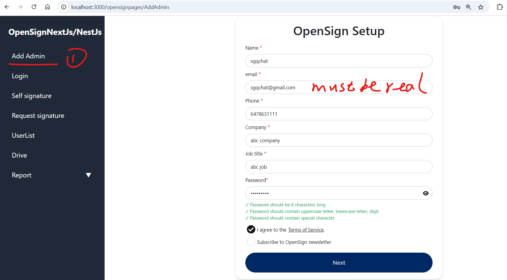

OpenSign PDF Editing Demo

This is a demo project for PDF editing using Next.js, NestJS, MongoDB, Docker, PineCone, Kuberneters, and the Parse Library.

👉 For more details, please refer to the original repository:
https://github.com/OpenSignLabs/OpenSign

🚀 Getting Started

1.Navigate to the client directory and rename env.local to .env.local.

2.Navigate to the server directory and rename env to .env.

3.Set the appropriate values for SMTP_USER_EMAIL and SMTP_PASS in the .env file.
(These credentials can be obtained from your Google account.)

4.From the root directory (OpenSignNextJsDemo in the case), start the application with the following command (assuming yarn is installed)

docker compose up --force-recreate

☁️Azure File Storage Support (Optional)
This app supports Azure Blob Storage. To enable it, follow these steps:

Set the following environment variables:

1.Set up the below content:

AZURE_CONNECTION=''
CONTAINER_NAME=''
BLOB_URL_PREFIX=''

2.Assign a valid value to this fileAdapterId_common in the Utils.tsx (currently undefined)

3.Assign a valid value to this fileAdapterId_common in the UtilsForOpenSign.ts (currently undefined)

📝 Usage Instructions

1.Add an admin user

2.Login

3.Self signature

4.Request Signature  

5.View the documents

6.Chat with AI tool

Note: If you want to use the ai chatbot tool, please apply it on pinecone website for test purpose.  
#Fill in PINECONE_API_KEY/OPENAI_TEXT_EMBEDDING_MODEL/PINECONE_ENVIRONMENT  
#ai chatbot  
LLAMA_CLOUD_API_KEY=''  
OPENAI_API_KEY=''  
#PINECONE_API_KEY=''  
PINECONE_API_KEY=''  
OPENAI_TEXT_EMBEDDING_MODEL='text-embedding-3-small'  
PINECONE_ENVIRONMENT=''

If you find the loading speed of pdf is slow, the reason is in the getDocumentDetails method:  
The reason is:  
 When loading a document,this method invokes AI method to parse the document. Solution: Invoke AI method to parse the document after loading the document.

If you want to test kuberneters, please follow the below steps(I tested it on wsl ubuntu):  
1.Install the minikube  
2.Start the minikube:  
minikube start --driver=docker  
3.Register an account in dockerhub, sgqfelix in this case.  
4.Execute the commands:  
docker build -t sgqfelix/opensign-server:v1 ./server  
docker push sgqfelix/opensign-server:v1  
docker build --build-arg NEXT_PUBLIC_XParseApplicationId=openSignApp --build-arg NEXT_PUBLIC_XParseMasterKey=openSignKey --build-arg NEXT_PUBLIC_OpenSignServerURL=http://127.0.0.1:4000/parse -t sgqfelix/opensign-client:v1 ./client  
docker push sgqfelix/opensign-client:v1  
5. Apply the k8s.yaml:  
 kubectl apply -f k8s.yaml:  
6. Start frontend:  
kubectl port-forward svc/client 30000:3000  
  
7. Start backend:
kubectl port-forward svc/server 4000:4000  
  
If the command: kubectl port-forward svc/server 4000:4000 doesn't work, try to get the pod and use the command like this:
kubectl port-forward pod/server-f6d45fc46-4fsj8 4000:4000  
8. Demo:
  
Note: I remove the email setting in k8s.yaml, so the app can't send email after signature(If needed, add settings in k8s.yaml).Also, replace the below variables:
LLAMA_CLOUD_API_KEY: "xxx"
OPENAI_API_KEY: "xxx"
PINECONE_API_KEY: "xxx"

I hope this can help everyone who needs it, and if you like, please star ⭐ the original repository:https://github.com/OpenSignLabs/OpenSign
